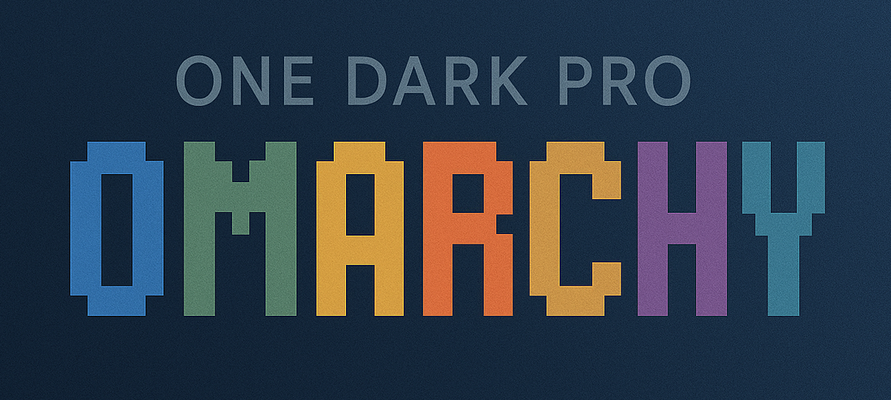
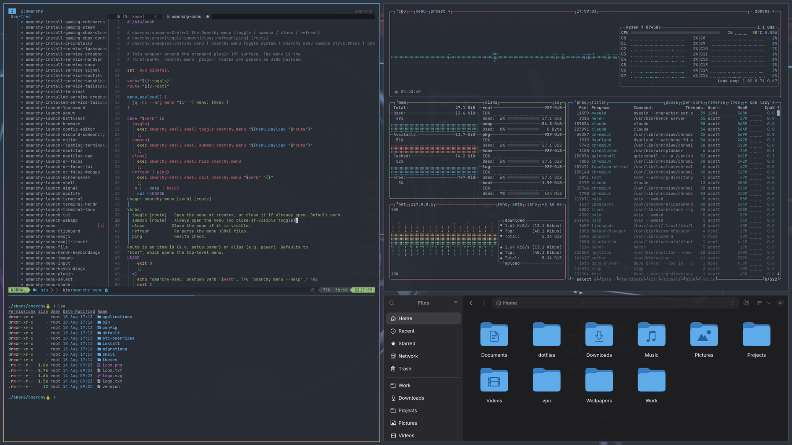

# One Dark Pro Theme for Omarchy



A One Dark Pro theme for [Omarchy](https://omarchy.org/), inspired by the popular One Dark Pro editor color scheme.

### Preview:



### Prompt:

The [Starship](https://starship.rs) prompt is based off [gruvbox-rainbow Preset](https://starship.rs/presets/gruvbox-rainbow). Currently you will need to copy [starship.toml](./starship.toml) to your `~/.config` folder.

### Font:
I quite enjoy the [SauceCodePro](https://www.nerdfonts.com/font-downloads) Nerd Font

### Tmux:
There is also a One Dark Pro theme for Tmux, available at [tmux-one-dark-pro](https://github.com/odedlaz/tmux-onedark-theme)

## Requirements

Omarchy 4 (Quattro) or newer. The theme is defined by a single `colors.toml`
palette; Omarchy generates the per-app configs (Alacritty, Ghostty, Kitty,
Foot, btop, Helix, Chromium, VS Code, Obsidian, the Omarchy shell, and
Hyprland borders) from it at theme-set time.

Neovim is the exception: the theme ships its own `neovim.lua` pointing at
[onedarkpro.nvim](https://github.com/olimorris/onedarkpro.nvim), the upstream
One Dark Pro port, rather than using the generated palette-driven default.

For Omarchy 3 and earlier, use the [`omarchy-3`](../../tree/omarchy-3) branch.

## Installation

```bash
omarchy theme install https://github.com/sc0ttman/omarchy-one-dark-pro-theme.git
```

Then:

```bash
omarchy theme set one-dark-pro
```

## Dimmed backdrop for modals (optional)

By default, snacks.nvim pickers open with no backdrop, so the rest of the
screen stays at full brightness. Every built-in picker layout hardcodes
`backdrop = false` (`snacks/picker/config/layouts.lua`), and LazyVim resolves
`picker.layout` through a *function* that returns one of those presets — so a
plain `picker = { layout = { backdrop = 60 } }` override never takes effect.

Override the presets instead. Add
`~/.config/nvim/lua/plugins/snacks-backdrop.lua`:

```lua
return {
  "folke/snacks.nvim",
  opts = {
    picker = {
      layouts = {
        default = { layout = { backdrop = 60 } },
        vertical = { layout = { backdrop = 60 } },
      },
    },
  },
}
```

`backdrop` is the opacity of the dim layer, 0-100. Lower is darker.

This requires an **opaque** editor. snacks skips the backdrop whenever
`Normal` has no background (`snacks/util/init.lua`: `M.color("Normal", "bg")
== nil`), so a transparency script that clears `Normal` disables the dimming
entirely. You can have a transparent editor or the dimmed backdrop, not both.

Note this covers snacks pickers and snacks floats. Windows owned by other
plugins (which-key, lazy.nvim, mason) draw their own floats and are unaffected.

## Transparency (optional, mutually exclusive with the above)


The theme ships opaque by default: the editor sits on `#282c34` and floats,
popups and pickers sit on `#21252b`, so modals read as raised panels.

If you want a transparent editor, add this to
`~/.config/nvim/plugin/after/transparency.lua`. It clears the editor surface
only and leaves floats alone — clearing `NormalFloat` and `Pmenu` too is what
makes modals look flat and washed out:

```lua
local groups = {
  "Normal",
  "NormalNC",
  "EndOfBuffer",
  "SignColumn",
  "LineNr",
  "CursorLineNr",
  "FoldColumn",
  "Folded",
  "MsgArea",
  "WinSeparator",

  -- Sidebars. Drop this block to keep the file tree opaque.
  "NeoTreeNormal",
  "NeoTreeNormalNC",
  "NeoTreeEndOfBuffer",
  "NeoTreeWinSeparator",
  "NvimTreeNormal",
  "NvimTreeEndOfBuffer",

  -- Deliberately NOT listed, so modals keep their contrast:
  --   NormalFloat, FloatBorder, FloatTitle, Pmenu, PmenuSel,
  --   WhichKeyFloat, TelescopeNormal, TelescopeBorder,
  --   SnacksPicker*, Notify*Body, Notify*Border
}

local function apply()
  for _, name in ipairs(groups) do
    local ok, hl = pcall(vim.api.nvim_get_hl, 0, { name = name, link = false })
    if ok and hl.bg then
      hl.bg = nil
      vim.api.nvim_set_hl(0, name, hl)
    end
  end
end

vim.api.nvim_create_autocmd("ColorScheme", {
  group = vim.api.nvim_create_augroup("user_transparency", { clear = true }),
  callback = apply,
})

apply()
```

Two things worth knowing:

- **You lose the picker backdrop.** snacks.nvim skips its screen-dimming scrim
  whenever `Normal` has no background. With a transparent editor you see the
  terminal through the gap instead of a dim wash. You cannot have both.
- **Re-applying is handled.** Omarchy re-sources this file after
  `omarchy theme set`, and the `ColorScheme` autocmd covers any other
  colorscheme change. `clear = true` stops the autocmd stacking when the file
  is re-sourced.
